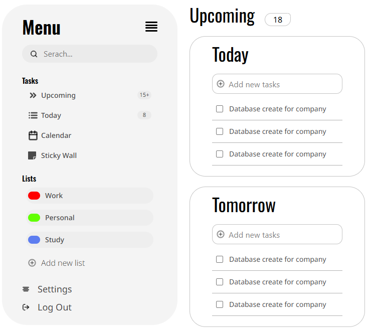

# To-Do App with React Js & Tailwind Css

This to-do application built with React and Tailwind CSS, designed to help you organize your daily tasks efficiently.

## Features
- **User Authentication**
  - Secure login/signup flow🔓
  - Logout functionality

- **Task Management**
  - Today's tasks view vi
  - Add/edit/delete tasks📑
  - View tasks with dates📅

## Technologies Used
1. React.js (Frontend framework)co
2. Tailwind CSS (Styling)
3. React Router (Navigation)

## Future Enhancements
- Dark mode toggleto
- Mobile app version

## Contributing
Contributions are welcome! Please fork the repository and create a pull request with your improvements.

## Live Demo 
Check out the live version: [To-Do App]()

## Contact

For support or inquiries:  
Email: [mehranmohamadi1311@gmail.com](mailto:your.email@example.com)  
Instagram_Id : mehran_7_10